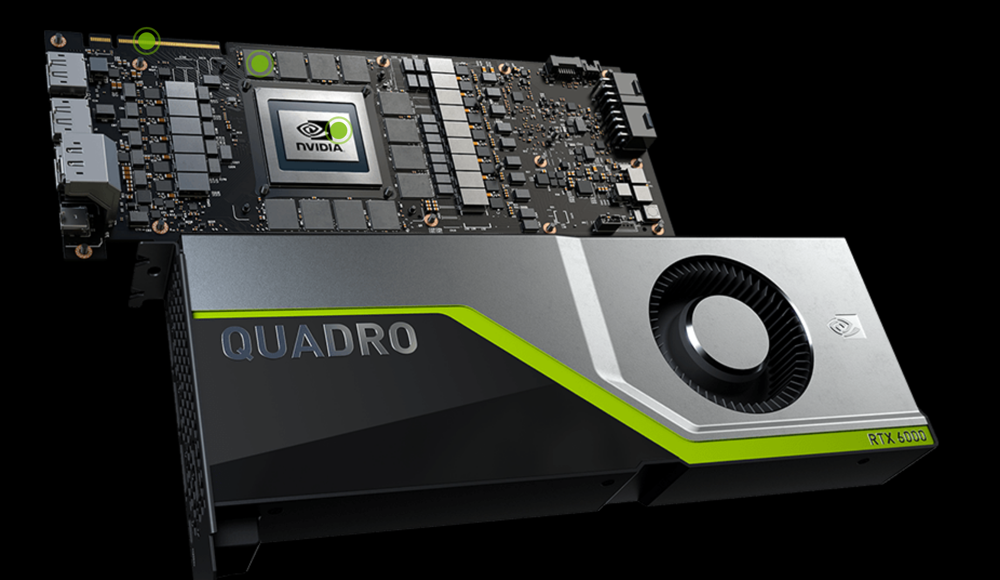

# Heterogeneous Parallel Computing

For basically all the 21st century two trends have dominated the area of High Perfomance Computing. The first one is the increase number of cores in CPUs from the dual core to the current CPUs on consumer market with 4, 8 and more cores. The second trend is the availability of modern coprocessors.

Coprocessors are devices that take some processing out of the CPU by specializing on specific tasks. Those coprocessors have not all the capabilities of CPUs and in general are not able to act as a CPU but they are very efficient in certain tasks. Examples of coprocessors in recent years are the Intel Xeon Phi coprocessors and most notoriously for this lesson GPUs in particular those from NVIDIA that thanks to CUDA we will examine in these series of lectures.

These trends will most likely follow and enhance in the foreseeable future. CPUs will come with 20, 40 and even more cores per socket. GPUs will become more common in addition to another specialized coprocessors such as FPGAs, and neural processors.

In this lesson we will concentrate on parallel computing with CUDA and OpenACC.
The central theme about using GPUs is to manage a large number of computing threads a number that is 2 or 3 orders of magnitude larger than the number of computing threads on CPUs. In contrast to what is called *multithreading parallel computing*, on GPUs we talk about *many-threading parallel computing*.

The first GPUs used for general computing, came from repurposing GPUs.
GPUs were originally designed to compute textures, graphics and rotations of 3D graphics for display on screen. These tasks do not require for most part double precision numbers. Only relatively recently double precision capabilities were integrated in those GPUs but for most part significant performance edge can be achieved when you can work with single precision floats.

Memory bandwidth is another important constrainer in GPUs. As GPUs have their own memory and cannot manage the central RAM, the ability to perform better on a GPU depends on enough processing being done with the data allocated on the GPU memory before the data is copied back to the Host RAM. A GPU must be capable of transferring large amounts of data, processing the data for a meaningful mount of time and return the results back in order to produce a positive return.

As such GPUs were designed for very specific tasks and not all tasks can be efficiently being offloaded to the GPU. There are tasks for which CPUs perform better and will continue to do so in the near future. At the end we will have what we called **heterogeneous parallel computing** a paradigm where parallel computing is exploited at 3 different and even entangled levels.

First is CPU multithreading execution. In the next lesson we will demonstrate one example of OpenMP a popular model for these kind of parallelism. In CPU multithreading we use the ability of modern CPUs to have several cores that see the same memory. The next level is coprocessor parallelism, exemplified with OpenACC, OpenCL and CUDA. Using for example GPUs certain tasks what require many threads with relatively small amount of memory can be processed on those devices and get an advantage from them. The final level is distributed computing with a prototypical case is MPI. We will demonstrate a brief example of MPI in the next lesson but it is out of scope for this workshop.

## Accelerators (like GPUs) in the world largest supercomputers

NVIDIA GPUs Powered 168 of The Top500 Supercomputers On The Planet.
Eight of the world’s top 10 supercomputers now use NVIDIA GPUs, InfiniBand networking or both. They include the most powerful systems in the U.S., Europe and China.
The fastest supercomputers all rely on Accelerators.
More than 50% of the computational power in the top500 comes from accelerators.

As per the latest figures, it looks like NVIDIA GPUs are powering the bulk of the supercomputers in the Top500 list with a total of 168 systems while AMD's CPUs and GPUs power a total of 121 supercomputers. At the same time, Supercomputers housing AMD and NVIDIA GPU-based accelerators are largely running Intel CPUs which cover around 400 supercomputers and that's a huge figure & while the number of systems running Intel CPUs are in a clear lead in quantity, AMD actually wins the crown for the fastest supercomputer around in the form of Frontier.

### Frontier

HPE Cray EX235a, AMD Optimized 3rd Generation EPYC 64C 2GHz, **AMD Instinct MI250X**, Slingshot-11, HPE
DOE/SC/Oak Ridge National Laboratory
United States 	

 * CPU cores 8,699,904 	
 * Rmax (PFlop/s): 1,194.00 	
 * Rpeak (PFlop/s) : 1,679.82 
 * Power (kW) : 22,703

### Summit

IBM Power System AC922, IBM POWER9 22C 3.07GHz, **NVIDIA Volta GV100**, Dual-rail Mellanox EDR Infiniband, IBM
DOE/SC/Oak Ridge National Laboratory
United States 

 * CPU cores 2,414,592
 * Rmax (PFlop/s): 148.60	
 * Rpeak (PFlop/s) : 200.79 
 * Power (kW) : 10,096

## WVU High-Performance Computer Clusters

West Virginia University has 2 main clusters: Thorny Flat and Dolly Sods, our newest cluster that will be available later in August 2023.

### Thorny Flat

Thorny Flat is a general-purpose HPC cluster with 178 compute nodes, most nodes have 40 CPU cores. The total CPU core count is 6516 cores. 
There are 47 NVIDIA GPU cards ranging from P6000, RTX6000, and A100

### Dolly Sods

Dolly Sods is our newest cluster and it is specialized in GPU computing. It has 37 nodes and 155 NVIDIA GPU cards ranging from A30, A40 and A100.
The total CPU core count is 1248.

## GPUs on Thorny Flat

**NVIDIA Quadro RTX6000**

|                               | RTX 6000 | P 6000 |
|:------------------------------|:-------|:---------|
| Architecture                  | Turing | Pascal   |
|CUDA Parallel-Processing Cores |	4,608  |  3,840   |
|Bus width                      |384 bit | 384 bit  |
|Memory Clock                   | 1750   | 1127 MHz |
|NVIDIA Tensor Cores            |	576 | |
|NVIDIA RT Cores                |	72 | |
|GPU Memory |	24 GB GDDR6 | 24 GB GDDR5X |
|FP32 Performance |	16.3 TFLOPS | 12.63 TFLOPS |
|FP64 Performance | 564 GFLOPS | 394 GFLOPS |
|Max Power Consumption |	260 W | 250 W |
|CUDA   |	6.1 | 6.1 |
|OpenCL | 1.2 | 1.2 |

## Knowing the GPUs on the machine

A first view of the availability of GPUs can be seen with the command:

~~~
$> nvidia-smi
~~~
{: .source}

Thorny Flat has several machines with GPUs the output in one of them is:

~~~
+-----------------------------------------------------------------------------+
| NVIDIA-SMI 455.32.00    Driver Version: 455.32.00    CUDA Version: 11.1     |
|-------------------------------+----------------------+----------------------+
| GPU  Name        Persistence-M| Bus-Id        Disp.A | Volatile Uncorr. ECC |
| Fan  Temp  Perf  Pwr:Usage/Cap|         Memory-Usage | GPU-Util  Compute M. |
|                               |                      |               MIG M. |
|===============================+======================+======================|
|   0  Quadro P6000        Off  | 00000000:37:00.0 Off |                  Off |
| 16%   28C    P0    58W / 250W |      0MiB / 24449MiB |      0%   E. Process |
|                               |                      |                  N/A |
+-------------------------------+----------------------+----------------------+
|   1  Quadro P6000        Off  | 00000000:AF:00.0 Off |                  Off |
| 17%   27C    P0    57W / 250W |      0MiB / 24449MiB |      0%   E. Process |
|                               |                      |                  N/A |
+-------------------------------+----------------------+----------------------+
|   2  Quadro P6000        Off  | 00000000:D8:00.0 Off |                  Off |
| 16%   28C    P0    58W / 250W |      0MiB / 24449MiB |      0%   E. Process |
|                               |                      |                  N/A |
+-------------------------------+----------------------+----------------------+

+-----------------------------------------------------------------------------+
| Processes:                                                                  |
|  GPU   GI   CI        PID   Type   Process name                  GPU Memory |
|        ID   ID                                                   Usage      |
|=============================================================================|
|  No running processes found                                                 |
+-----------------------------------------------------------------------------+
~~~
{: .output}

~~~
+-----------------------------------------------------------------------------+
| NVIDIA-SMI 455.32.00    Driver Version: 455.32.00    CUDA Version: 11.1     |
|-------------------------------+----------------------+----------------------+
| GPU  Name        Persistence-M| Bus-Id        Disp.A | Volatile Uncorr. ECC |
| Fan  Temp  Perf  Pwr:Usage/Cap|         Memory-Usage | GPU-Util  Compute M. |
|                               |                      |               MIG M. |
|===============================+======================+======================|
|   0  Quadro RTX 6000     Off  | 00000000:1A:00.0 Off |                    0 |
| N/A   38C    P0    55W / 250W |      0MiB / 22698MiB |      0%      Default |
|                               |                      |                  N/A |
+-------------------------------+----------------------+----------------------+
|   1  Quadro RTX 6000     Off  | 00000000:1B:00.0 Off |                    0 |
| N/A   39C    P0    56W / 250W |      0MiB / 22698MiB |      0%      Default |
|                               |                      |                  N/A |
+-------------------------------+----------------------+----------------------+
|   2  Quadro RTX 6000     Off  | 00000000:3D:00.0 Off |                    0 |
| N/A   39C    P0    57W / 250W |      0MiB / 22698MiB |      0%      Default |
|                               |                      |                  N/A |
+-------------------------------+----------------------+----------------------+
|   3  Quadro RTX 6000     Off  | 00000000:3E:00.0 Off |                    0 |
| N/A   40C    P0    57W / 250W |      0MiB / 22698MiB |      0%      Default |
|                               |                      |                  N/A |
+-------------------------------+----------------------+----------------------+
|   4  Quadro RTX 6000     Off  | 00000000:8B:00.0 Off |                    0 |
| N/A   37C    P0    56W / 250W |      0MiB / 22698MiB |      0%      Default |
|                               |                      |                  N/A |
+-------------------------------+----------------------+----------------------+
|   5  Quadro RTX 6000     Off  | 00000000:8C:00.0 Off |                    0 |
| N/A   37C    P0    56W / 250W |      0MiB / 22698MiB |      0%      Default |
|                               |                      |                  N/A |
+-------------------------------+----------------------+----------------------+
|   6  Quadro RTX 6000     Off  | 00000000:B5:00.0 Off |                    0 |
| N/A   37C    P0    54W / 250W |      0MiB / 22698MiB |      0%      Default |
|                               |                      |                  N/A |
+-------------------------------+----------------------+----------------------+
|   7  Quadro RTX 6000     Off  | 00000000:B6:00.0 Off |                    0 |
| N/A   37C    P0    57W / 250W |      0MiB / 22698MiB |      0%      Default |
|                               |                      |                  N/A |
+-------------------------------+----------------------+----------------------+

+-----------------------------------------------------------------------------+
| Processes:                                                                  |
|  GPU   GI   CI        PID   Type   Process name                  GPU Memory |
|        ID   ID                                                   Usage      |
|=============================================================================|
|  No running processes found                                                 |
+-----------------------------------------------------------------------------+
~~~
{: .output}

## Launching interactive sessions with GPUs

A very simple way of launching an interactive job is using the command ``srun``:
The following is an example of a request for an interactive job asking for 1 GPU 8 CPU cores for 2 hours:

	trcis001:~$ srun -p comm_gpu_inter -G 1 -t 2:00:00 -c 8 --pty bash

You can verify the assigned GPU using the command nvidia-smi:

	trcis001:~$ srun -p comm_gpu_inter -G 1 -t 2:00:00 -c 8 --pty bash
	srun: job 22599 queued and waiting for resources
	srun: job 22599 has been allocated resources
	tbegq200:~$ nvidia-smi
	Wed Jan 18 13:27:01 2023
	+-----------------------------------------------------------------------------+
	| NVIDIA-SMI 515.43.04    Driver Version: 515.43.04    CUDA Version: 11.7     |
	|-------------------------------+----------------------+----------------------+
	| GPU  Name        Persistence-M| Bus-Id        Disp.A | Volatile Uncorr. ECC |
	| Fan  Temp  Perf  Pwr:Usage/Cap|         Memory-Usage | GPU-Util  Compute M. |
	|                               |                      |               MIG M. |
	|===============================+======================+======================|
	|   0  NVIDIA A100-PCI...  Off  | 00000000:3B:00.0 Off |                    0 |
	| N/A   28C    P0    31W / 250W |      0MiB / 40960MiB |      0%      Default |
	|                               |                      |             Disabled |
	+-------------------------------+----------------------+----------------------+

	+-----------------------------------------------------------------------------+
	| Processes:                                                                  |
	|  GPU   GI   CI        PID   Type   Process name                  GPU Memory |
	|        ID   ID                                                   Usage      |
	|=============================================================================|
	|  No running processes found                                                 |
	+-----------------------------------------------------------------------------+

The command above shows an NVIDIA A100 as the GPU assigned to us during the lifetime of the job.


