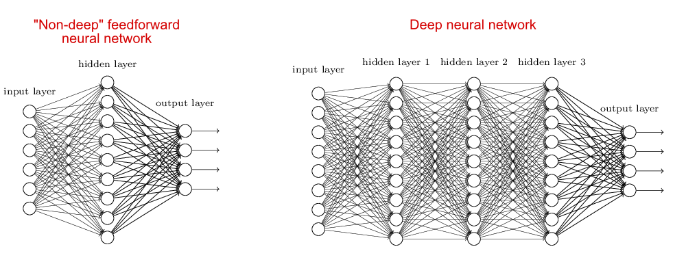

Deep Learning is one of the techniques in Machine Learning with most success in a variety of problems. From Classification to Regression. Its ability to account for complexity is remarkable.

Deep Learning is one of the most active areas in Machine Learning today. However, Neural networks have been around for decades, so the question is why now?
As we will learn in this workshop the hype created around Deep Learning in the last decade is due to the convergence of a set of elements that propelled Deep Learning from an obscure topic in Machine Learning to the driving force of many of our activities in daily life. We can summarize those elements as:

   * The availability of large datasets, thanks in part to the internet and big tech companies.
   
   * Powerful accelerators such as **GPUs** that are capable of processing data for some tasks (Linear Algebra) at scales outperform CPUs by at least one order of magnitude.

Every time you are using your phone or smart TV, computer, neural networks are working for you. They have become almost both ubiquitous and invisible as electricity became from the beginning of the 20th century. In a way, Machine Learning and Deep Learning are the fuel of some sort of new industrial revolution or at least with the potential to become something like it. 

## Deep Learning, Machine Learning, and Artificial Intelligence

Deep Learning is part of the area of Machine Learning, a set of techniques to produce models that use examples to build the model, rather than using a hardcoded algorithm. 
Machine Learning itself is just an area of Artificial Intelligence, an area of computer science dedicated to studying how computers can perform tasks usually considered as intellectual.

### Learning from data, a scientific perspective

The idea of learning from data is not foreign to scientist.
The objective of science is to create models that explain phenomena and provides predictions that can be confirmed or rejected by experiments or observations.

Scientists create models that not only give us insight about nature but also equations that allow us to make predictions.  In most cases, clean equations are simply not possible and we have to use numerical approximations but we try to keep the understanding. Machine Learning is used in cases where mathematical models are known, numerical approximations are not feasible, and we
We are satisfied with the answers even if we lost the ability to understand why the parameters of Machine Learning models work the way they do.

In summary, we need 3 conditions for using Machine Learning on a problem:

 * Good **data**
 * The existence of **patterns** on the data
 * The lack of a good mathematical model to express the **patterns** present on the **data**

### Kepler, an example of learning from data

  <table>
  <tr>
    <th></th>
    <th></th>
  </tr>
  </table>
  
  <table>
  <tr>
  <th></th>
  </tr>
  <tr>
  <th></th>
  </tr>
  </table>

    
## The two shores of Deep Learning

There are two ways to approach Deep Learning. The biological side and the mathematical side.

An Artificial Neural Network (ANN) is a computational model that is **loosely** inspired by the way biological neural networks in the animal brain process information.

From the other side, they can also be considered as a generalization of the Perceptron idea. A mathematical model 
for producing functions capable of getting close to a target function via an iterative process.

Both shores serve as good analogies if we are careful not to extrapolate the original ideas beyond their regime of validity. Deep Learning is not pretending to be models of the brain and the complexity of Deep Neural networks is far beyond that of what perceptrons were capable of doing. 

Let's explore these two approaches for a moment.

### Biological Neural Networks

From one side the idea of simulating synapsis in biological Neural Networks and using the knowledge about activation barriers and multiple connectivities as inspiration to create an Artificial Neural Network. The basic computational unit of the brain is a neuron. Approximately 86 billion neurons can be found in the human nervous system and they are connected with approximately 10¹⁴ — 10¹⁵ synapses

The idea with ANN is that synaptic strengths (the weights w in our mathematical model) are learnable and control the strength of influence and its direction: excitatory (positive weight) or inhibitory (negative weight) of one neuron on another. If the final sum of the different connections is above a certain threshold, the neuron can fire, sending a spike along its axon, which is the output of the network under the provided input.

### The Perceptron

The other origin is the idea of Perceptron in Machine Learning. 

Perceptron is a linear classifier (binary) and used in supervised learning. It helps to classify the given input data. As a binary classifier, it can decide whether or not an input, represented by a vector of numbers, belongs to some specific class. 

## Complexity of Neural Networks

When the neural network has no hidden layer it is just a linear classifier or Perceptron. When hidden layers are added the NN can account for non-linearity, in the case of multiple hidden layers have what is called a Deep Neural Network.

## In practice how complex it can be

A Deep Learning model can include:
    
 * **Input** (With many neurons)
 * **Layer 1** 
 * ...
 * ...
 * **Layer N**
 * **Output layer** (With many neurons)
    
For example, the input can be an image with thousands of pixels and 3 colors for each pixel. Hundreds of hidden layers and the output could also be an image. That complexity is responsible for the computational cost of running such networks.

##  Non-linear transformations with Deep Networks

Consider this ilustrative example from this [blog](http://colah.github.io/posts/2014-03-NN-Manifolds-Topology/):
We have two curves, as they are there is no way of creating a straight line that separates both curves.
There is however a curve capable of separating the space in two regions where each curve lives on its region.
Neural networks approach the problem by transforming the space in a non-linear way, allowing the two curves to be easily separable with a simple line.

     
  <table>
  <tr>
    <th></th>
    <th></th>
    <th></th>
  </tr>
  <tr>
    <th></th>
    <th></th>
  </tr>
      </table>

## Dynamic visualization of the transformations
     
In its basic form, a neural network consists of the application of affine transformations (scalings, skewings and rotations, and translations) followed by pointwise application of a non-linear function:
     

     
  <table>
  <tr>
    <th></th>
  </tr>
  </table>

      

  <table>
  <tr>
    <th></th> 
    <th></th>
  </tr>
  </table>

## Basic Neural Network Architecture

## Neural Network Zoo

Since neural networks are one of the more active research fields in machine learning, a large number of modifications have been proposed. In the following figure, a summary of the different node structures is drawn and from that, relations and acronyms are provided such that some of the different networks are related someway. The figure below shows a summary but let me give you a quick overview of a few of them.

1)  Feed forward neural networks (FF or FFNN) and perceptrons (P). They feed information from the front to the back (input and output, respectively). Neural networks are often described as having layers, where each layer consists of either input, hidden, or output cells in parallel. A layer alone never has connections and in general two adjacent layers are fully connected (every neuron from one layer to every neuron to another layer). One usually trains FFNNs through back-propagation, giving the network paired datasets of “what goes in” and “what we want to have coming out”.  Given that the network has enough hidden neurons, it can theoretically always model the relationship between the input and output. Practically their use is a lot more limited but they are popularly combined with other networks to form new networks.

2) Radial basis functions. This network is simpler than the normal FFNN, as the activation function is a radial function. Each RBFN neuron stores a “prototype”, which is just one of the examples from the training set. When we want to classify a new input, each neuron computes the Euclidean distance between the input and its prototype. Roughly speaking, if the input more closely resembles the class A prototypes than the class B prototypes, it is classified as class A.

3) Recurrent Neural Networks (RNN). These networks are designed to take a series of inputs with no predetermined limit on size. They are networks with loops in them, allowing information to persist.

4) Long/short term memory (LSTM) networks. There is a special kind of RNN where each neuron has a memory cell and three gates: input, output, and forget. The idea of each gate is to allow or stop the flow of information through them. 

5) Gated recurrent units (GRU) are a slight variation on LSTMs. They have one less gate and are wired slightly differently: instead of an input, output, and forget gate, they have an update gate.

6) Convolutional Neural Networks (ConvNet) is very similar to FFNN, they are made up of neurons that have learnable weights and biases. In a convolutional neural network (CNN, or ConvNet or shift invariant or space invariant) the unit connectivity pattern is inspired by the organization of the visual cortex, Units respond to stimuli in a restricted region of space known as the receptive field. Receptive fields partially overlap, over-covering the entire visual field. The unit response can be approximated mathematically by a convolution operation. They are variations of multilayer perceptrons that use minimal preprocessing. Their wide applications are in image and video recognition, recommender systems, and natural language processing. CNN's requires large data to train on.

From <http://www.asimovinstitute.org/neural-network-zoo>
    

    
    

## Activation Function

Each internal neuron receives input from several other neurons, computes the aggregate, and propagates the result based on the activation function. 

Neurons apply activation functions at these summed inputs. 

Activation functions are typically non-linear.

 * The **Sigmoid Function** produces a value between 0 and 1, so it is intuitive when a probability is desired and was almost standard for many years.
 
 * The **Rectified Linear (ReLU)** activation function is zero when the input is negative and is equal to the input when the input is positive. Rectified Linear activation functions are currently the most popular activation function as they are more efficient than the sigmoid or hyperbolic tangent.
 
     * Sparse activation: In a randomly initialized network, only 50% of hidden units are active.
     
     * Better gradient propagation: Fewer vanishing gradient problems compared to sigmoidal activation functions that saturate in both directions.
     
     * Efficient computation: Only comparison, addition, and multiplication.
     
     * There are Leaky and Noisy variants.
     
 * The **Soft Plus** shared some of the nice properties of ReLU and still preserves continuity on the derivative.

## Inference or Foward Propagation

 <table>
  <tr>
    <th></th>
    <th></th>
    <th></th>
  </tr>
  <tr>
    <td>Receiving Input</td>
    <td>Computing Hidden Layer</td>
    <td>Computing Output</td>
  </tr>
</table> 

### Receiving Input

 * H1 Weights = (1.0, -2.0, 2.0)
 * H2 Weights = (2.0, 1.0, -4.0)
 * H3 Weights = (1.0, -1.0, 0.0)
 * O1 Weights = (-3.0, 1.0, -3.0)
 * O2 Weights = (0.0, 1.0, 2.0)
 
### Hidden Layer

 * H1 = Sigmoid(0.5 * 1.0 + 0.9 * -2.0 + -0.3 * 2.0) = Sigmoid(-1.9) = .13
 * H2 = Sigmoid(0.5 * 2.0 + 0.9 * 1.0 + -0.3 * -4.0) = Sigmoid(3.1) = .96
 * H3 = Sigmoid(0.5 * 1.0 + 0.9 * -1.0 + -0.3 * 0.0) = Sigmoid(-0.4) = .40
 
### Output Layer

 * O1 = Sigmoid(.13 * -3.0 + .96 * 1.0 + .40 * -3.0) = Sigmoid(-.63) = .35
 * O2 = Sigmoid(.13 * 0.0 + .96 * 1.0 + .40 * 2.0) = Sigmoid(1.76) = .85

In terms of Linear Algebra:

 $$\begin{bmatrix}
1 & -2 &  2\\
2 &  1 & -4\\
1 & -1 &  0\\
\end{bmatrix}
\cdot
\begin{bmatrix}
0.5\\
0.9\\
-0.3\\
\end{bmatrix}
=
\begin{bmatrix}
-1.9\\
3.1\\
-0.4\\
\end{bmatrix}
$$

The fact that we can describe the problem in terms of Linear Algebra is one of the reasons why Neural Networks are so efficient on **GPUs**. The same operation as a single execution line looks like this:

## Biases

It is also very useful to be able to offset our inputs by some constant. 
You can think of this as centering the activation function or translating the solution (next slide). 
We will call this constant the bias, and there will often be one value per layer.

## Accounting for Non-Linearity

Neural networks are so effective in classification and regression due to their ability to combine linear and non-linear operations on each step of the evaluation.

 * The matrix multiply provides the skew and scale.
 * The bias provides the translation.
 * The activation function provides the twist.

## Training Neural Networks: The backpropagation

During training, once we have forward propagated the network, we will find that the final output differs from the known output. The weights must need to be modified to produce better results in the next attempt. 

How do we know which new weights? to use? 

We want to minimize the error on our training data. 
Given labeled inputs, select weights that generate the smallest average error on the outputs.
We know that the output is a function of the weights: 

$$E(w_1,w_2,w_3,...i_1,...t_1,...)$$

Just remember that the response of a single neuron can be written as

$$f (b + \sum_{i=1}^N a_i w_i),$$ 

where the $$a_i$$ is the output of the previous layer (or the input if it is the second layer) and $$w_i$$ are the weights. 
So to figure out which way, we need to change any particular weight, say $$w_3$$, we want to calculate

$$\frac{\partial E}{\partial \{w,i,t\}}$$

If we use the chain rule repeatedly across layers we can work our way backward from the output error through the weights, adjusting them as we go. Note that this is where the requirement that activation functions must have nicely behaved derivatives comes from.

This technique makes the weight inter-dependencies much more tractable. 
An elegant perspective on this can be found from [Chris Olahat Blog](http://colah.github.io/posts/2015-08-Backprop)

With basic calculus, you can readily work through the details. 

You can find an excellent explanation from the renowned [3Blue1Brown](https://www.youtube.com/watch?v=Ilg3gGewQ5U)

## Solving the back propagation efficiently

The explicit solution for backpropagation leaves us with potentially many millions of simultaneous equations to solve (real nets have a lot of weights). 

They are non-linear to boot. Fortunately, this isn't a new problem created by deep learning, so we have options from the world of numerical methods.

The standard has been **Gradient Descent** local minimization algorithms.

To improve the convergence of Gradient Descent, refined methods use adaptive **time step** and incorporate **momentum** to help get over a local minimum. **Momentum** and **step size** are the two hyperparameter

The optimization problem that Gradient Descent solves is a local minimization. We don't expect to ever find the actual global minimum. Several techniques have been created to avoid a solution being trapped in a local minima.

We could/should find the error for all the training data before updating the weights (an epoch). However, it is usually much more efficient to use a stochastic approach, sampling a random subset of the data, updating the weights, and then repeating with another. This is the **mini-batch Gradient Descent**

## Modern Neural Network Architectures

### Convolutional Neural Networks

A convolutional neural network (CNN) is a Deep Learning algorithm that can take in an input image, assign importance (learnable weights and biases) to various aspects/objects in the image, and be able to differentiate one from the other. The pre-processing required in a ConvNet is much lower as compared to other classification algorithms. While in primitive methods filters are hand-engineered, with enough training, ConvNets can learn these filters/characteristics.

As seen from this figure, CNN consists of several convolutional and subsampling layers optionally followed by fully connected layers. 

Let us say that our input to the convolutional layer is a $$m \times m \times r$$ pixels in an image where $$m$$ is the height and width of the image and $$r$$ is the number of channels, e.g. an RGB image has $$r=3$$. The convolutional layer will have $$k$$ filters (or kernels) of size $$n \times n \times q$$ where n is smaller than the dimension of the image and $$q$$ can either be the same as the number of channels r or smaller and may vary for each kernel. The size of the filters gives rise to the locally connected structure which is each convolved with the image to produce k feature maps of size $$m−n+1$$. 

A simple demonstration is shown in the figure below, where we assume a binary picture and a single filter of a 3x3 matrix. The primary purpose of Convolution is to extract features from the input image. Convolution preserves the spatial relationship between pixels by learning image features using small squares of input data. The orange square slide over the figure and for each 3x3 overlap, I multiply every element of the 3x3 submatrix of the figure with the convolution and then I add all elements afterward. 

 
 
 It is clear that different values of the filter matrix will produce different Feature Maps for the same input image.
 
 Typical filter matrices are now described. 
 
 For edge detection:
 $$\begin{bmatrix}
1&0&-1\\
0&0&0\\
-1&0&1\\
\end{bmatrix}
\;\;
\begin{bmatrix}
0&1&0\\
1&-4&1\\
0&1&0\\
\end{bmatrix}
\;\;
\begin{bmatrix}
-1&-1&-1\\
-1&8&-1\\
-1&-1&-1\\
\end{bmatrix}
$$

For sharpen:
$$\begin{bmatrix}
0&-1&0\\
-1&5&-1\\
0&-1&0\\
\end{bmatrix}
$$

In practice, a CNN learns the values of these filters on its own during the training process (although we still need to specify parameters such as the number of filters, filter size, architecture of the network, etc. before the training process). The more filters we have, the more image features get extracted, and the better our network becomes at recognizing patterns in unseen images.

The other step that is described in this section is the pooling. Spatial Pooling (also called subsampling or downsampling) reduces the dimensionality of each feature map but retains the most important information. Spatial Pooling can be of different types: Max, Average, Sum, etc.

### Graph Neural Network

Before I end and get more into Neural networks and different packages, I would like to discuss one of the most recent proposals in the literature. The so-called Graph Neural Network. 

As much of the available information in fields like social networks, knowledge graphs, recommender systems, and even life science comes in the form of graphs, very recently people have developed specific neural networks for these types of applications. Most of the discussion here has been taken from [Zhou's paper](https://arxiv.org/pdf/1812.08434.pdf).

A Graph Neural Network is a type of Neural Network which directly operates on the Graph structure, which we define by a set of nodes and edges $$G = (V, E)$$. A typical application of GNN is node classification. Essentially, every node in the graph is associated with a label, and we want to predict the label of the nodes without ground truth. Here we describe briefly this application and let the reader search for more information.

In the node classification problem setup, each node $$V$$ is characterized by its feature $$x_v$$ and associated with a ground-truth label $$t_v$$. Given a partially labeled graph $$G$$, the goal is to leverage these labeled nodes to predict the labels of the unlabeled. It learns to represent each node with a $$d$$ dimensional vector (state) $$\vec{h}_V$$ which contains the information of its neighborhood. The state embedding $$\vec{h}_V$$ is an $$s$$-dimension vector of node $$V$$ and can be used to produce an output $$\vec{o}_V$$ such as the node label. Let $$f$$ be a parametric function, called a local transition function, that is shared among all nodes and updates the node state according to the input neighborhood, and let $$g$$ be the local output function that describes how the output is produced. Then, $$\vec{h}_V$$ and $$\vec{o}_V$$ are defined as follows:

$$
\vec{h}_V = f ( \vec{x}_V, \vec{x}_{CO[V]}, \vec{h}_{ne[V]}, \vec{x}_{ne[V]})
$$

$$
\vec{o}_V = g(\vec{h}_V, \vec{x}_V)
$$

where $$\vec{x}_V$$, $$\vec{x}_{co[V]}$$, $$\vec{h}_{ne[V]}$$, $$\vec{x}_{ne[V]}$$ are the features of $$V$$, the features of its edges, the states, and the features of the nodes in the neighborhood of $$V$$, respectively.

Let $$\vec{H}$$, $$\vec{O}$$ , $$\vec{X}$$ , and $$\vec{X}_N$$ be the vectors constructed by stacking all the states, all the outputs, all the features, and all the node features, respectively. Then we have a compact form as:
$$ \vec{H} = F (\vec{H}, \vec{X}) $$
$$ \vec{O} = G(\vec{H},\vec{X}_N) $$
where $$F$$, the global transition function, and $$G$$, the global output function are stacked versions of f and g for all nodes in a graph, respectively. The value of $$\vec{H}$$ is the fixed point of Eq. 3 and is uniquely defined with the assumption that $$F$$ is a contraction map. Since we are seeking a unique solution for $$\vec{h}_v$$, we can apply Banach fixed point theorem and rewrite the above equation as an iteratively update process. Such operation is often referred to as message passing or neighborhood aggregation.
$$ \vec{H}^{t+1} = F (\vec{H}^t, \vec{X}) $$
where $$\vec{H}$$ and $$\vec{X}$$ denote the concatenation of all the $$\vec{h}$$ and $$\vec{x}$$, respectively.
The output of the GNN is computed by passing the state h_v as well as the feature $$x_v$$ to an output function g.
$$ \vec{o} = g(\vec{h}_V,\vec{x}_V) $$

More details on this methodology can be found in the paper above.

### Generative Adversarial Networks

Generative adversarial networks (GANs) are deep neural net architectures comprised of two nets, pitting one against the other (thus the “adversarial”). Introduced in 2014 by Goodfellow and other people. 

GANs’ potential is huge because they can learn to mimic any distribution of data. That is, GANs can be taught to create worlds eerily similar to our own in any domain: images, music, speech, prose. 

To understand GANs, you should know how generative algorithms work. Up to now, most of the algorithms we have discussed are the so-called discriminative algorithms, where we try to predict the output from a given set of features. 

In the Bayesian language, we are trying to predict 

$$P(c_j ; x_1,x_2,\cdots,x_n)$$. 

In GANs, we are concerned with a different idea,

We try two features given a certain label. 

Therefore, here we would like to build 

$$P(x_1,x_2,\cdots,x_n ; c_j)$$.

The idea in GANs then is to have two neural networks. One is called the generator, which generates features, and the other network, the discriminator evaluates its authenticity, i.e. the discriminator decides whether each instance of data that it reviews belongs to the actual training dataset or not. For example, we try to analyze a book by a great author (for example Garcia Marquez). We could analyze the language used in his texts but for this example, the generator should be able to create words and the discriminator should be able to recognize if these are authentic. The idea of the generator then is to create words that were not created by Garcia Marquez but that the discriminator is unable to distinguish.

# Milestones of Neural Networks and Deep Learning Frameworks

## The history

### Artificial Intelligence is born

The term **Artificial Intelligence** (AI) was first coined by John McCarthy in 1956.
In the early days, the focus was on hard coding rules that computers can follow via inference.
That was called the age on **symbolic AI** and let to the expert systems of the 80s and early 90s.

### Deep Learning old names

Deep Learning has received different names over time. It was called **Cybernetics** in the 70s, **Connectionism** in the 80s. **Neural Networks** in the 90s and today we call it **Deep Learning**

### First DL Frameworks from 2000's to 2012

  * First high-level tools such as MATLAB, OpenNN, and Torch. 
  * They were not tailored specifically for neural network model development or having complex user APIs
  * No **GPU** support. 
  * Machine Learning practitioners do a lot of manual manipulations for the input and output. 
  * Limited capability for complex networks.
  
### AlexNet in 2012

  * In 2012, Alex Krizhevsky et al. from the University of Toronto proposed a deep neural network architecture later known as [AlexNet](https://papers.nips.cc/paper/2012/file/c399862d3b9d6b76c8436e924a68c45b-Paper.pdf) that achieved impressive accuracy on ImageNet dataset and outperformed the second-place contestant by a large margin. This outstanding result sparked excitement in deep neural networks after a long time of being considered the
  
      * *Alex Krizhevsky et al.,* [ImageNet Classification with Deep Convolutional Neural Networks](https://papers.nips.cc/paper/2012/file/c399862d3b9d6b76c8436e924a68c45b-Paper.pdf) (2012), NeurIPS 2012
  
  * Deep Learning frameworks were born such as **Caffe**, **Chainer** and **Theano**. 
  * Users could conveniently build more complex deep neural network models such as CNN, RNN, and LSTM. 
  * Single **GPU** first and soon after multi-**GPU** training was supported which significantly reduced the time to train these models and enabled training large models that were not able to fit into a single **GPU** memory earlier. 
  * **Caffe** and **Theano** used a declarative programming style while **Chainer** adopted the imperative programming style. 
  
### Big Tech companies jump in

  * After the success of **AlexNet** drew great attention in the area of computer vision and reignited the hope of neural networks, large tech companies joined the force of developing deep learning frameworks. 
  * **Google** open sourced the famous **TensorFlow** framework that is still the most popular deep learning framework in the ML field up to date. 
  * **Facebook** hired the inventor of Caffe and continued the release of **Caffe2**; at the same time, Facebook AI Research (FAIR) team also released another popular framework **PyTorch** which was based on the Torch framework but with the more popular Python APIs. 
  * **Microsoft** Research developed the **CNTK** framework. 
  * **Amazon** adopted **MXNet** from Apache, a joint academic project from the University of Washington, CMU, and others.
  
  * TensorFlow and CNTK borrowed the declarative programming style from Theano whereas **PyTorch** inherited the intuitive and user-friendly imperative programming style from Torch. 
  * While *imperative programming* style is more flexible (such as defining a while loop etc.) and easy to trace, *declarative programming* style often provides more room for memory and runtime optimization based on computing graph. 
  * MXNet, dubbed as “mix”-net, enjoyed the benefits of both worlds by supporting both a set of symbolic (declarative) APIs and a set of imperative APIs at the same time and optimized the performance of models described using imperative APIs via a method called hybridization.
  
### ResNet in 2016

  * In 2015 ResNet was proposed by Kaiming He et al. and again pushed the boundary of image classification by setting another record in ImageNet accuracy. 
    * *Kaiming He et al.,* [Deep Residual Learning for Image Recognition](https://openaccess.thecvf.com/content_cvpr_2016/papers/He_Deep_Residual_Learning_CVPR_2016_paper.pdf) (2016), CVPR 2016

  * Industry and academia realized that deep learning was going to be the next big technology trend to solve challenges in various fields that were not deemed possible before. 
  * Deep Learning frameworks were polished to provide clear-defined user APIs, optimized for multi-**GPU** training and distributed training and spawned many model zoos and toolkits that were targeted to specific tasks such as computer vision, natural language processing, etc. 
  * François Chollet almost single-handedly developed the Keras framework that provides a more intuitive high-level abstraction of neural networks and building blocks on top of existing frameworks such as TensorFlow and MXNet. 
  * Keras became the de facto model level APIs in TensorFlow 2.x.

### Consolidating Deep Learning Frameworks

  * Around 2019 start a period of consolidation in the area of Deep Learning frameworks with the duopoly of two big “empires”: TensorFlow and PyTorch.
  * PyTorch and TensorFlow represent more than 90% of the use cases of deep learning frameworks in research and production. 
  * **Theano**, primarily developed by the Montreal Institute for Learning Algorithms (MILA) at the Université de Montréal is no longer actively developed and the last version is from 2020.
  * **Chainer** team transitioned their development effort to PyTorch in 2019.
  * Microsoft stopped active development of the **CNTK** framework and part of the team moved to support PyTorch on Windows and ONNX runtime. 
  * **Keras** was assimilated by TensorFlow and became one of its high-level APIs in the TensorFlow 2.0 release. 
  * **MXNet** remained a distant third in the deep learning framework space.
  
### Doing Deep Learning at large

  * Large model training is a new trend in 2020 to our days.
  * With the birth of BERT [3] and its Transformer-based relatives such as GPT-3 [4], the ability to train large models became a desired feature of deep learning frameworks. 
      * Jacob Devlin et al., [BERT: Pre-training of Deep Bidirectional Transformers for Language Understanding](https://arxiv.org/abs/1810.04805) (2018)
      * Tom B. Brown et al., [Language Models are Few-Shot Learners](https://proceedings.neurips.cc/paper/2020/file/1457c0d6bfcb4967418bfb8ac142f64a-Paper.pdf) (2020), NeurIPS 2020

  * Now training takes place at a scale up to hundreds if not thousands of **GPU** devices and custom accelerators.       
  * Deep learning frameworks adopted the imperative programming style for their flexible semantics and easy debugging. 
  * To compensate for performance frameworks also provide user-level decorators or APIs to achieve high performance through some JIT (just-in-time) compiler techniques.
  
## Current trends

  * **Compiler-based operator optimization**: Operator kernels are usually implemented manually or via some third-party libraries such as BLAS, CuDNN, or OneDNN. There are challenges associated with the movement from development to production. In addition, the growth of new deep learning algorithms is often much faster than the iteration of these libraries making new operators often not supported by these libraries. 
  * **Deep learning compilers**: Apache TVM, MLIR, Facebook Glow, etc. have been proposed to optimize and run computations efficiently on any hardware backend. They are well positioned to serve as the entire backend stack in the deep learning frameworks.
  * **Unified API standards**: Since the majority of machine learning practitioners and data scientists are familiar with the NumPy library, this is the de-facto standard for multidimensional array manipulation. Still, at other levels, many deep learning frameworks share similar but slightly different user APIs.
    [JAX](https://jax.readthedocs.io/en/latest/notebooks/quickstart.html) is NumPy on the CPU, **GPU**, and TPU, with great automatic differentiation for high-performance machine learning research. It likely became a superset of NumPy with agnostic operation on many devices.
  * **Transparent Multi-node or multi-device training**: New frameworks such as [OneFlow](https://docs.oneflow.org/en/master/index.html), treat data communication as part of the overall computation graph of the model training. Data movement optimization is central for multiple training strategies (single device vs multi-device vs distributed training) as the previous deep learning frameworks do, it can provide a simpler user interface with better performance.



